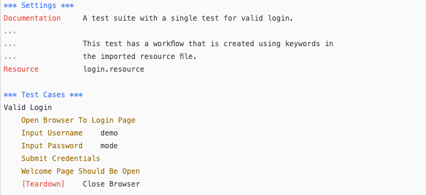
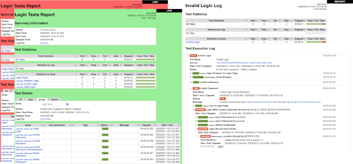

# Giới thiệu tổng quát 

## Tại sao lại sử dụng Robot Framework ?

* Cho phép sử dụng cú pháp dạng bảng dễ dàng để tạo các trường hợp thử nghiệm một cách đồng nhất.

* Cung cấp khả năng tạo các từ khóa cấp cao có thể tái sử dụng từ các từ khóa hiện có.

* Cung cấp các báo cáo kết quả và nhật ký dễ đọc ở định dạng HTML.

* Độc lập với nền tảng và ứng dụng.

* Cung cấp một API thư viện đơn giản để tạo các thư viện thử nghiệm tùy chỉnh có thể được triển khai nguyên bản bằng Python.

* Cung cấp giao diện dòng lệnh và các tệp đầu ra dựa trên XML để tích hợp vào cơ sở hạ tầng xây dựng hiện có (các hệ thống tích hợp liên tục).

* Hỗ trợ kiểm thử các ứng dụng web, API REST, ứng dụng di động, các quy trình đang chạy, kết nối tới các hệ thống từ xa thông qua Telnet hoặc SSH, v.v.

* Hỗ trợ tạo các trường hợp thử nghiệm theo hướng dữ liệu.

* Có hỗ trợ sẵn cho các biến, đặc biệt hữu ích cho việc thử nghiệm trong các môi trường khác nhau.

* Cung cấp tính năng gán nhãn để phân loại và chọn các trường hợp thử nghiệm để thực thi.

* Cho phép tích hợp dễ dàng với hệ thống kiểm soát nguồn: các bộ thử nghiệm chỉ là các tệp và thư mục có thể được phiên bản hóa cùng với mã sản xuất.

* Cung cấp thiết lập và phá dỡ ở cấp độ trường hợp thử nghiệm và bộ thử nghiệm.

* Kiến trúc mô-đun hỗ trợ tạo thử nghiệm ngay cả cho các ứng dụng có nhiều giao diện khác nhau.

## Kiến trúc 

Robot Framework là một khung kiểm thử chung, không phụ thuộc vào ứng dụng và công nghệ. Nó có kiến trúc mô-đun cao được minh họa trong sơ đồ dưới đây.

Dữ liệu kiểm thử được lưu trữ dưới dạng bảng đơn giản, dễ chỉnh sửa. Khi Robot Framework được khởi động, nó xử lý dữ liệu, thực thi các trường hợp kiểm thử và tạo ra các bản ghi nhật ký và báo cáo. Lõi của khung không biết gì về đối tượng đang được kiểm thử, và sự tương tác với đối tượng này được xử lý bởi các thư viện. Các thư viện có thể sử dụng trực tiếp các giao diện ứng dụng hoặc sử dụng các công cụ kiểm thử cấp thấp hơn làm trình điều khiển.

## Ví dụ

