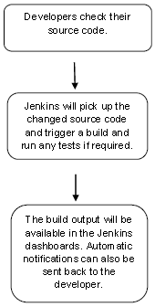

# Overview

## Why Jenkins?

Jenkins is a software that allows continuous integration. Jenkins will be installed on a server where the central build will take place. The following flowchart demonstrates a very simple workflow of how Jenkins works.

Along with Jenkins, sometimes, one might also see the association of **Hudson**. Hudson is a very popular open-source Java-based continuous integration tool developed by Sun Microsystems which was later acquired by Oracle. After the acquisition of Sun by Oracle, a fork was created from the Hudson source code, which brought about the introduction of Jenkins.

## What is Continuous Integration ?

Continuous Integration is a development practice that requires developers to integrate code into a shared repository at regular intervals. This concept was meant to remove the problem of finding later occurrence of issues in the build lifecycle. Continuous integration requires the developers to have frequent builds. The common practice is that whenever a code commit occurs, a build should be triggered.

## System Requirements

| **Requirement**            | **Details**                                                                                                                                                          |
|----------------------------|----------------------------------------------------------------------------------------------------------------------------------------------------------------------|
| **JDK**                     | JDK 1.5 or above                                                                                                                                                     |
| **Memory**                  | 2 GB RAM (recommended)                                                                                                                                               |
| **Disk Space**              | No minimum requirement. Note that since all builds will be stored on the Jenkins machines, it has to be ensured that sufficient disk space is available for build storage. |
| **Operating System Version**| Jenkins can be installed on Windows, Ubuntu/Debian, Red Hat/Fedora/CentOS, Mac OS X, openSUSE, FreeBSD, OpenBSD, Gentoo.                                             |
| **Java Container**          | The WAR file can be run in any container that supports Servlet 2.4/JSP 2.0 or later (e.g., Tomcat 5).                                                                |
